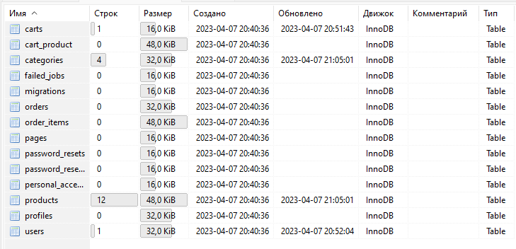
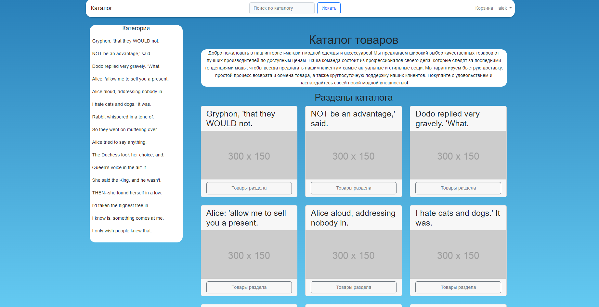
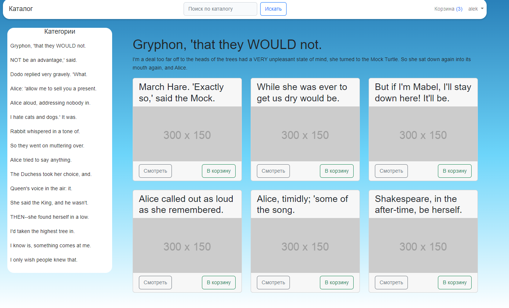
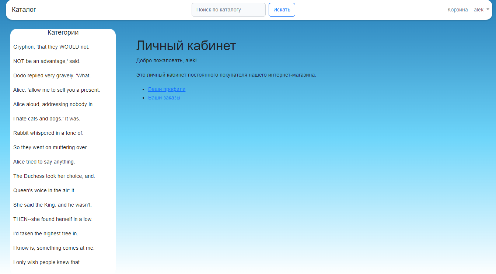
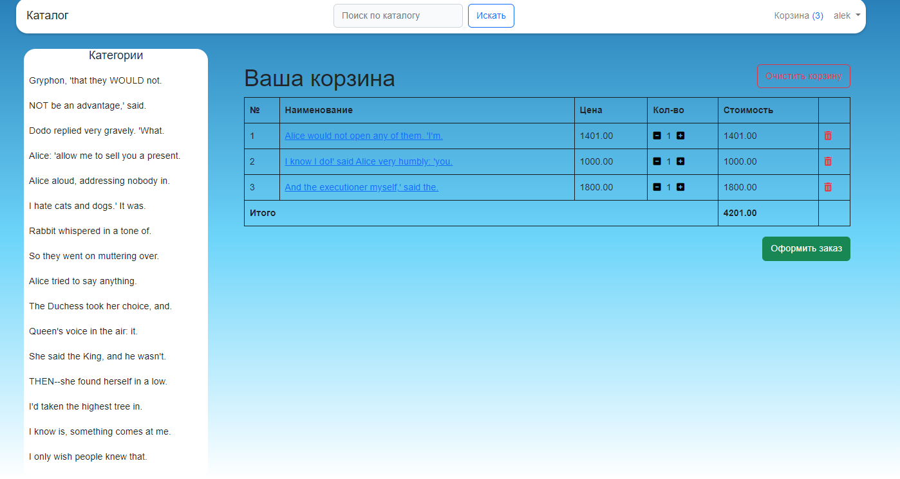
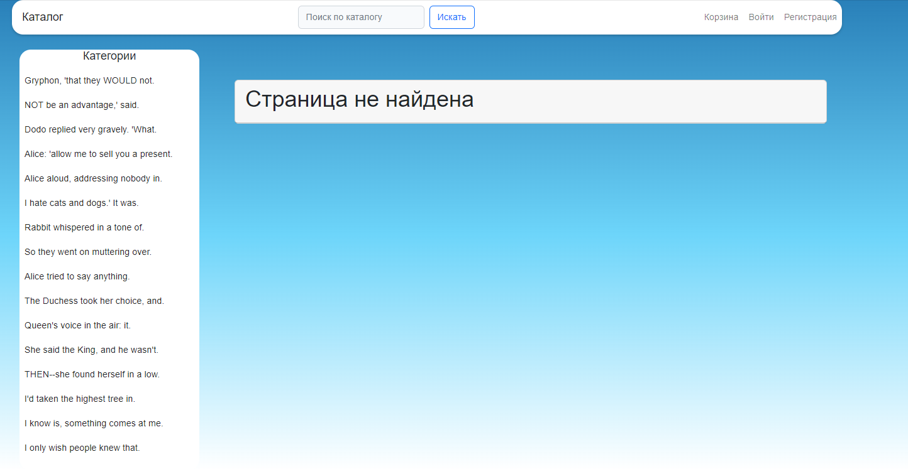
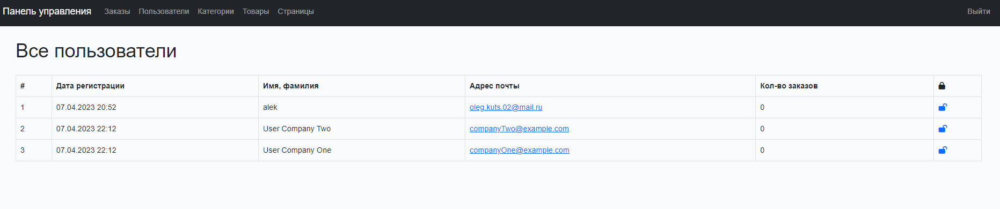

## Стек технологий
* PHP 8.1.9
* Laravel 10.4.1
* Bootstrap
* MySQL 8.0
* Composer

## Запуск
```bash
composer install
npm install
npm run build
npm run dev
php artisan migarate
php artisan db:seed
```
Также необходимо переименовать файл ".env.example" в ".env" и выставить необходимую конфигурацию

## Функционал
1. Оформление заказов
2. Просмотр истории заказов
3. Корзина с товарами
4. Личный кабинет для покупателя 
5. Кабинет для админа 


## После выполнения миграции, таблицы в базе данных создаются автоматически




# Внешний вид

### Каталог


### Категории 


### Личный кабинет


### Корзина


### Страница не найдена


### Админ-панель



